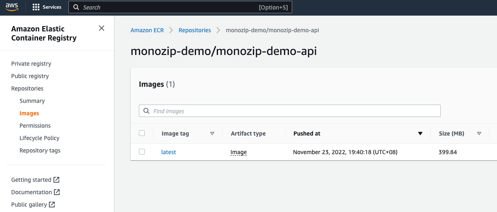

## Create organization on terraform cloud
```
https://app.terraform.io/app
```

## Login terraform cloud
```bash
cdktf login
```

## Create workspaces
-  Create workspaces


-  Settings `remote state sharing`


## Create OAuth app on github
```
https://github.com/settings/developers
```


## Modifying the Configuration File
```bash
cp config.json.back config.json
```

```json
{
  "Stage": "test",
  "Region": "ap-northeast-1",
  "AccessKey": "xxxxxxxxxxxxxxxx",
  "SecretKey": "xxxxxxxxxxxxxxxxxxxxxxxxxxxxxxxxxxxxxxxx",
  "CognitoAuthCallbackUrls": [
    "https://xxxxxxxxxxxx.com/Login?k=v"
  ],
  "CognitoAuthLogoutUrls": [
    "https://xxxxxxxxxxxx.com/Login"
  ],
  "CognitoAuthS3BucketName": "monozip-demo-customized-messaging",
  "GithubClientID" : "oauth app client id",
  "GithubClientSecret" : "oauth app client secret",
  "OIDCIssuerURL" : "https://xxxxxxxxx.execute-api.ap-northeast-1.amazonaws.com/dev",
  "ServicePort": 8080,
  "RDSDeletionProtection": false
}
```

## Deploy
### MonozipDemoNetworkStack
```bash
cdktf deploy MonozipDemoNetworkStack
```


### MonozipDemoStorageStack
```bash
cdktf deploy MonozipDemoStorageStack
```
ElasticSearch


PostgresDatabase


### MonozipDemoMiddlewareStack
```bash
cdktf deploy MonozipDemoMiddlewareStack
```
RabbitMQ


### MonozipDemoGatewayStack
```bash
cdktf deploy MonozipDemoGatewayStack
```
ALB


### MonozipDemoImageRepoStack
```bash
cdktf deploy MonozipDemoImageRepoStack
```

### MonozipDemoSecretsManagerStack
```bash
cdktf deploy MonozipDemoSecretsManagerStack
```


### Push image to ECR
```bash
aws ecr get-login-password --region ap-northeast-1 | docker login --username AWS --password-stdin xxxxxxxxxxxx.dkr.ecr.ap-northeast-1.amazonaws.com
docker push xxxxxxxxxxxx.dkr.ecr.ap-northeast-1.amazonaws.com/monozip-demo/monozip-demo-api:latest
```
or
```bash
todo github action 
```



### MonozipDemoComputeStack
```bash
cdktf deploy MonozipDemoComputeStack
```

### Testing

```bash

curl https://xxxx.xxxx.xxx/rebbitmq


```